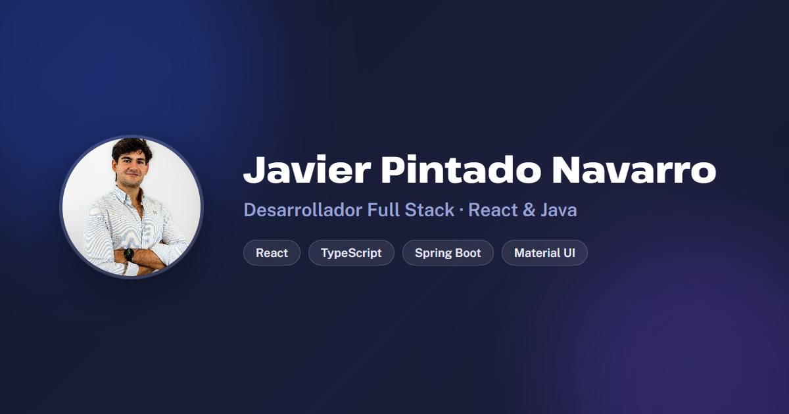

# Javier Pintado Navarro · Portfolio

Personal portfolio of **Javier Pintado Navarro**, full-stack developer (mostly React on the frontend, with Java and Spring Boot on the backend). It presents who I am, my work experience, my projects, my skills and what I do outside of code.

**Live:** https://javier-pintado-portfolio.vercel.app



## Highlights

- **Single-page layout** with sections for About, Experience, Projects, Skills, Hobbies and Contact.
- **Light and dark mode**: it starts from the choice saved in the browser and, if there is none, from the system preference.
- **Project gallery**: screenshots appear as thumbnails and open full size in a viewer, with arrows, keyboard navigation and a counter.
- **Content separated from the code**: everything that is text lives in one file (`src/data/profile.ts`), so updating the portfolio never means touching a component.
- **Durations that never go stale**: ongoing positions only need a start date, and the elapsed time ("1 año 1 mes") is computed when the page loads.
- Downloadable CV, social preview image (Open Graph) and scroll animations.

## Tech stack

| Layer | Technology |
|---|---|
| UI | React 19, TypeScript, Material UI 7 (with Emotion) |
| Icons and fonts | Tabler Icons, Public Sans and Pathway Extreme (Fontsource) |
| Tooling | Vite, Oxlint |
| Hosting | Vercel |

## Getting started

```bash
yarn install        # or npm install
yarn dev            # http://localhost:5173
```

Other scripts:

```bash
yarn build          # type-check (tsc) and production build into dist/
yarn preview        # serve the production build locally
yarn lint           # Oxlint
```

## Project structure

```
src/
  data/profile.ts       All the content: profile, experience, projects, skills, hobbies
  components/
    sections/           One component per section of the page
    common/             Reusable pieces (scroll reveal, image gallery)
    layout/             Header and footer
  utils/duration.ts     Elapsed time for ongoing positions
  theme.ts              Material UI theme (light and dark)
public/
  cv/                   CV in PDF
  projects/<name>/      Project screenshots used by the gallery
  logos/                Company logos
```

## Updating the content

Almost everything is edited in `src/data/profile.ts`:

- **A new project**: add an entry to `projects` with its name, period, description, tags and GitHub link. Optionally add `demo` for a live link and `images` for the gallery (put the files in `public/projects/<name>/`).
- **A new job**: add an entry to `experience`. For a position that is still ongoing, set `since` (`YYYY-MM-DD`) instead of `duration`.
- **Skills and hobbies**: edit `skillGroups` and `hobbies`.

## Deployment

Every push to `main` is built and published automatically by Vercel. There is nothing else to configure: Vercel detects Vite and uses `yarn build` and the `dist/` folder.

## Author

**Javier Pintado Navarro** — [LinkedIn](https://www.linkedin.com/in/javier-pintado-navarro-06811a2ab/) · [GitHub](https://github.com/javipintado3)
